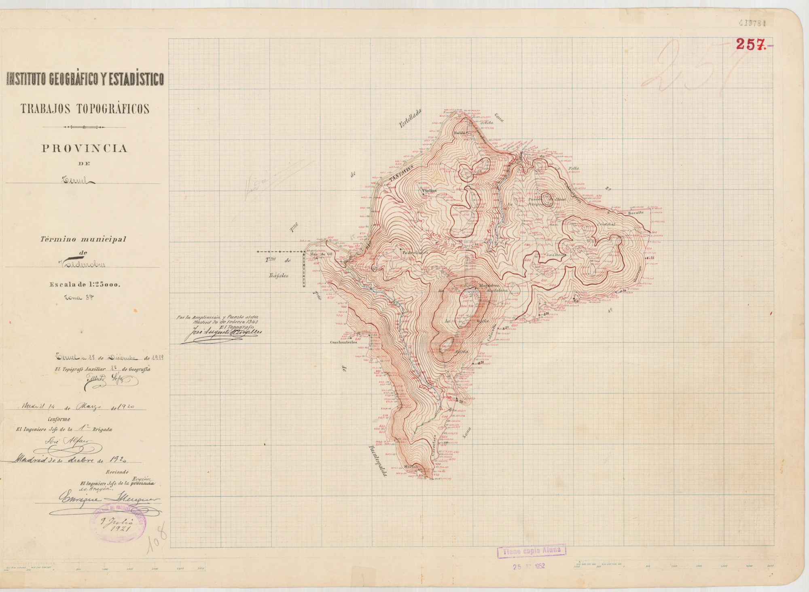
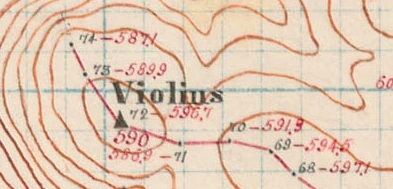
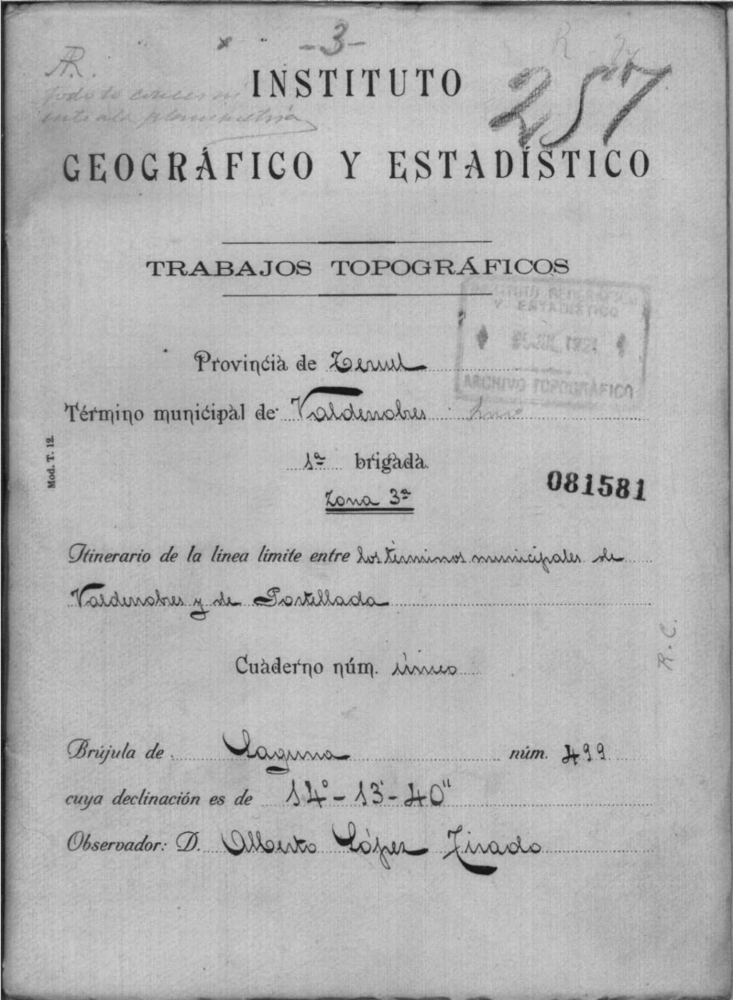
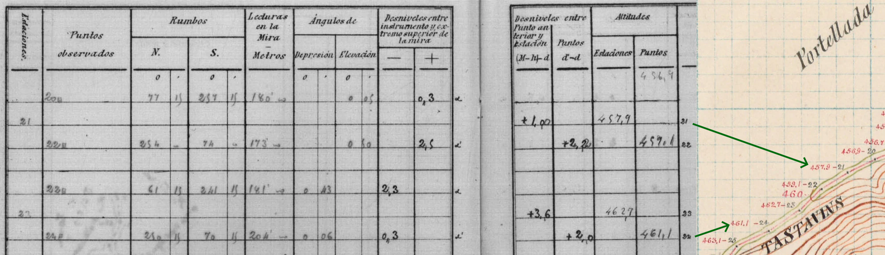
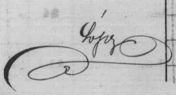

+++
category = "tech"
date = 2024-02-18
title = "Cartes espagnoles historiques d’arpentage"
+++

Cette carte a été un temps mon fond d’écran et a souvent suscité des questions. Cliquez pour avoir l’original (4,0 Mo).

Je l’ai trouvé sur le [centre de téléchargement de l’IGN espagnol](http://centrodedescargas.cnig.es/CentroDescargas/index.jsp#) et représente un coin d’espagne où je vais souvent.

<iframe width="750" height="600" frameborder="0" style="border:0" src="https://www.ign.es/iberpix/visor?center=12708.705278303103,4991326.190675466&zoom=14&layers=WMS*MTN25%20-%20Cuadriculas%20MTN25%20-%20RegCan95*https://www.ign.es/wms-inspire/cuadriculas*Grid-REGCAN95-lonlat-25k*true*false**1.3.0*true*true*true,GeoJSON*temp_1708186099780*eyJ0eXBlIjoiRmVhdHVyZUNvbGxlY3Rpb24iLCJmZWF0dXJlcyI6W10sImNycyI6eyJwcm9wZXJ0aWVzIjp7ImNvZGUiOiIzODU3In0sInR5cGUiOiJFUFNHIn19*false*eyJwYXJhbWV0ZXJzIjpbeyJwb2ludCI6eyJmaWxsIjp7ImNvbG9yIjoicmdiYSgyNTUsIDI1NSwgMjU1LCAwLjQpIiwib3BhY2l0eSI6MC40fSwic3Ryb2tlIjp7ImNvbG9yIjoiIzMzOTlDQyIsIndpZHRoIjoxLjV9LCJyYWRpdXMiOjV9LCJsaW5lIjp7ImZpbGwiOnsiY29sb3IiOiJyZ2JhKDI1NSwgMjU1LCAyNTUsIDAuNCkiLCJvcGFjaXR5IjowLjR9LCJzdHJva2UiOnsiY29sb3IiOiIjMzM5OUNDIiwid2lkdGgiOjEuNX19LCJwb2x5Z29uIjp7ImZpbGwiOnsiY29sb3IiOiJyZ2JhKDI1NSwgMjU1LCAyNTUsIDAuNCkiLCJvcGFjaXR5IjowLjR9LCJzdHJva2UiOnsiY29sb3IiOiIjMzM5OUNDIiwid2lkdGgiOjEuNX19fV0sImRlc2VyaWFsaXplZE1ldGhvZCI6Iigoc2VyaWFsaXplZFBhcmFtZXRlcnMpID0+IE0uc3R5bGUuU2ltcGxlLmRlc2VyaWFsaXplKHNlcmlhbGl6ZWRQYXJhbWV0ZXJzLCAnTS5zdHlsZS5HZW5lcmljJykpIn0="></iframe>

<iframe width="800" height="600" frameborder="0" style="border:0" src=""></iframe>
Les anciennes cartes, c’est toujours attirant. Mais celle-ci a la particularité d’être une carte de travail de 1919. C’est un brouillon pour ce qui allait devenir la première carte espagnole en qualité au `1:50000`. Un travail qui a commencé en 1875 pour se finir en 1968.

En explorant la carte dans ses détails, on découvre les chemins d’arpentage : par où sont passées les personnes pour prendre les mesures permettant de créer la carte. Le tracé rouge est le parcours, en noir le numéro de relevé et en rouge l’altitude calculée.

Mais les archives de l’IGN contiennent également les cahiers d’arpentage ! On y voit toutes les mesures faites par _topographe auxiliaire_ Alberto López, contre-signés par _l’ingénieur en chef de la 1ère brigade_ José Alfaro et enfin _l’ingénieur en chef du centre_ Enrique Merguer. Cliquez pour télécharger le PDF avec toutes les pages (3,5 Mo).

On peut donc faire le lien entre l’aprentage, et la carte, voici un extrait côte-à-côte de la carte et des mesures. Je suppose que les inscriptions au crayon sont les mesures, tandis qu’à la plume se sont les résultats calculés _a posteriori_.

.

C’est tout ce que j’ai à dire. Je conclus donc avec les pleines et les déliées de la signature du topographe auxiliaire López.

