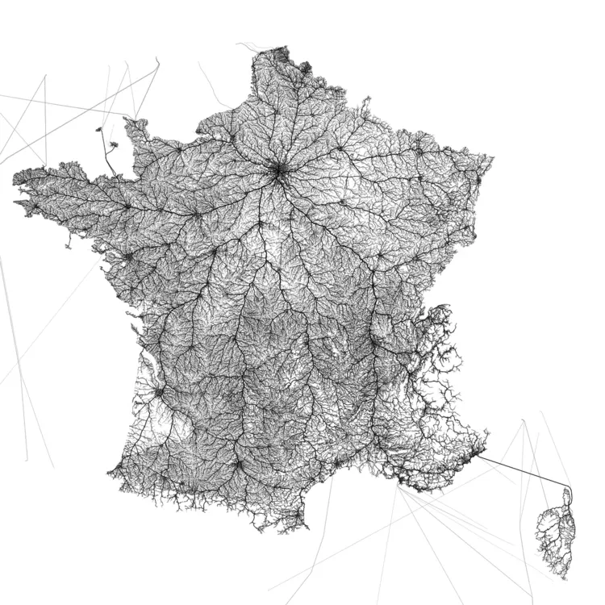
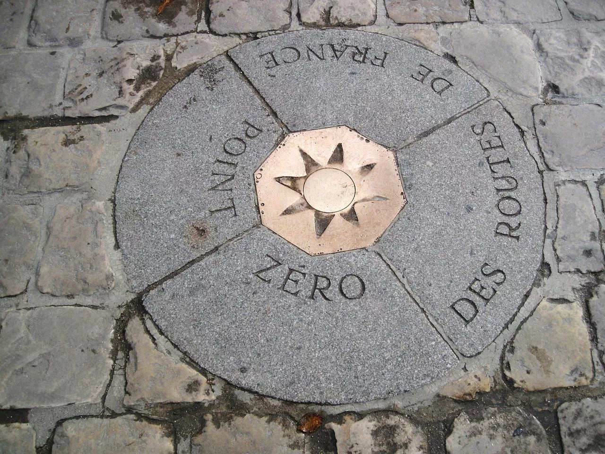

+++
category = "tech"
date = 2015-12-27
title = "Roads from Notre-Dame"
+++


I rewrote everything in rust for much more simplicity and explained it [a blog post in french](../routes-depuis).

Examples can be seen [over here](https://kdrive.infomaniak.com/app/share/880730/511b5eb2-8e8b-4904-ba1a-451b9269c993), and the code [on github](https://github.com/Tristramg/roads-from-nd/).


All roads lead to Rome and it makes great maps! The project [Roads to Rome](http://roadstorome.moovellab.com/) made a small buzz with their
gorgeous maps showing a superposition of many routes that lead to Rome.

They well deserve their success. The representation looks like a human
cardiovascular system, whose heart is Rome.

I was somewhat jealous for not having that idea first. Nor did I have
the aesthetic talent to make a beautiful representation, so I was
slightly condescending: “Meh. It’s only 20 lines of code for a Dijkstra
and some plotting”.

Having some free time in Perpignan with my family for a week, I tried to
copy their work. Here is a journal of what I did.

Since my laptop is a 4 years old netbook and due to my laziness to
optimise my code, the example will only cover France and not Europe on
the whole.

Data from OpenStreetMap under ODbL

# 1. Get the data

Of course I used [OpenStreetMap](https://www.openstreetmap.org).
However, processing all the data of France was too much for my modest
project [osm4routing](https://github.com/Tristramg/osm4routing). I used
the extraction part from [OSRM](http://project-osrm.org/).

I read the binary representation in the `.osrm` files. This
is not portable at all as the format is a temporary file format.
Actually, my code does not work anymore on their `develop` branch.

The street network of France consists of a little more than 30 millions
nodes and about the same amount of edges. As a pleasant bonus, OSRM also
reads ferry routes. This allows us to reach Corsica and other islands.

# 2. Compute all the routes

So we extracted a nice graph, with realistic travel durations. We now
want to compute all the routes that start from Notre-Dame. Indeed, while
all roads lead to Rome, all [roads start from Notre-Dame
(FR)](https://fr.wikipedia.org/wiki/Point_z%C3%A9ro_des_routes_de_France).

The starting point is the node
[677151951](http://www.openstreetmap.org/node/677151951#map=17/48.85359/2.34836)
in OpenStreetMap.

Luckily, computing all routes from a single node to every other has been
solved more than half a century ago.

This is exactly what [Dijkstra’s algorithm](https://en.wikipedia.org/wiki/Dijkstra%27s_algorithm) does.
In fact, I used the [Bellman-Ford algorithm](https://en.wikipedia.org/wiki/Bellman%E2%80%93Ford_algorithm)
as I did not care about performance and I preferred its trivial
implementation.

# 3. Count the use of every edge

Once we have all the routes from Notre Dame to all the nodes in France, we take each single route from Notre-Dame to every node in France and we count how many routes each edge occurs in.

All the edges are inserted into a [PostGIS](http://www.postgis.net)
database (Postgres with a geographical extension) with their coordinates
and use count.

All the steps until now were implemented in
[Rust](https://www.rust-lang.org) and are available
[here](https://github.com/tristramg/roads-from-nd/blob/master/src/main.rs).

Initially I planned to use QGis or Mapbox to make the rendering.
However, the size of the data made that impossible for any area larger
than the greater Paris.

# 4. Draw everything on a image

The coordinates are given as `[(longitude; latitude)]`. If you
plot them directly as `[(x; y)]` on a picture the result is
horrible at higher latitude. It is called the [plate carrée](https://en.wikipedia.org/wiki/Equirectangular_projection)
projection.

(By the way, if you plot `[(lat; lon)]` it will be even worse😉)

The official projection for continental France is [Lambert 93](http://spatialreference.org/ref/epsg/rgf93-lambert-93/). With
Postgis and a lot of waiting, I could trivially reproject all the
coordinates.

As I could not find how to use a graphics library in Rust, I ended up
drawing the edges in C++ using [Cairo](http://cairographics.org).

But first I
[dumped](https://github.com/tristramg/roads-from-nd/blob/master/dump.cc)
all the edges in a binary file in order to save some time when
experimenting around.

With a lot of trial and error I found a reasonable balance between the
width of each edge and its darkness.

For the pictures with the largest resolution, I
[drew](https://github.com/tristramg/roads-from-nd/blob/master/draw.cc)
every edge that was used by more than 10 routes. That represents about
18 million edges.

# 5. Scale for Europe

So I got a nice representation of all the roads from Notre-Dame in
France. What about Europe, like in the project I ripped off? My 4 years
old netbook was mistreated enough.

I would need a better machine (much more RAM, an SSD disk would be
nice), and to make some improvements:

-   Use Dijkstra’s algorithm instead of Bellman-Ford
-   Find a more effective way to count every edge use
-   Skip the intermediate step with PostGIS; dump directly into a binary file
-   Find a proper way to draw 100 million little dashes?

# 6. Little bonus

<video width="750" controls src="/images/roads_from_nd.mp4"> Animation of the roads </video>

